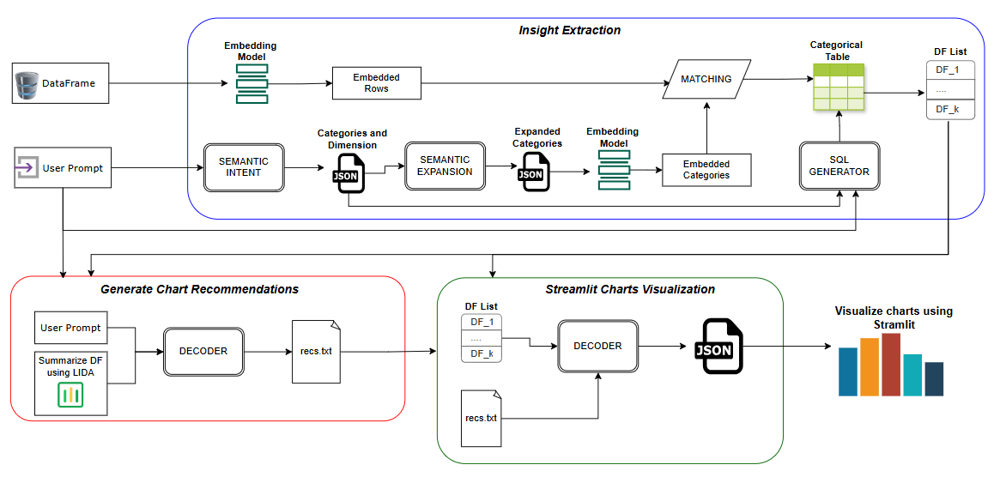

# 🚀 Bayer Hackathon — Insight Extraction & Auto-Visualization RAG

This project implements a full **Insight Extraction + Visualization Pipeline** designed for the Bayer Hackathon.  
Given:
- a **user prompt**, and  
- a **dataset retrieved by a RAG system**,  

the system automatically produces:

- a **semantic intent JSON**
- enriched **categories** and semantic expansions
- embedding-based **categorical assignment**
- **SQL analytics** based on the user's prompt
- **visualization recommendations**
- a fully dynamic **Streamlit dashboard**

Everything runs **end-to-end** with a single pipeline.

---

# 🧩 System Pipeline Overview



The architecture is built around **three core modules**, all cooperating to turn natural language into structured analytics and visual insights.

---

# 1️⃣ Insight Extraction Module  
**Location:** `insight_extraction/`

This module interprets the user question and structurally organizes the dataset for downstream analysis.

### ✔ Semantic Intent
Transforms the natural-language prompt into a structured JSON containing:
- requested metrics  
- grouping dimensions  
- filters  
- semantic categories  
- logical operations  

This provides a clean, machine-readable blueprint for analytics generation.

### ✔ Semantic Category Expansion
For each category belonging to a dimension, the system expands it using an LLM:
- textual description  
- synonyms  
- example sentences  

These enrichments make semantic matching far more robust.

### ✔ Embedding-Based Category Assignment
We embed:
- dataset rows  
- expanded category descriptions  

Using cosine similarity, each row is assigned to the closest semantic category.

The result is a **new categorical dataset** ready for analytics.

### ✔ SQL Generator (Labelled SQL Blocks)
Using the enriched dataset, the module generates SQL queries in a consistent, parser-friendly format


Key guarantees:
- multiple, coherent insight queries  
- deterministic structure (`-- HEADER` labels)  
- full compatibility with our SQL executor  
- ready for visualization  

---

# 2️⃣ Generate Chart Recommendations
**Location:** `visualization_recommender/`

Given:
- SQL-generated analytics DataFrames  
- the original user prompt  

the module selects the **best possible charts** to communicate insights:
- trends → line charts  
- category comparisons → bar charts  
- distributions → histograms  
- proportions → pie charts  
- anomalies → scatter/line hybrid  

It outputs a file:

recs.txt

containing high-level visualization instructions.

---

# 3️⃣ Streamlit Auto-Dashboard  
**Location:** `from_text_to_streamlit_app/`

A fully dynamic **Streamlit frontend** turns insights + recommendations into a live dashboard.

The app automatically:
- loads all analytic DataFrames (DF_1, DF_2, …)
- reads `recs.txt`
- renders each recommended chart
- supports multiple sections and layouts
- produces a polished analytical UI

Run it with:

```bash
pip install -r requirements.txt
streamlit run app.py
▶️ Running the Full Pipeline
```
# 🌟 Credits
Developed by:
- Martina Fabiani
- Alessio Franchini
- Christian Petruzzella
- Niccolò Settimelli

